# ScrapNC

Low Cost, 3D Printed, minimally performant, scalable CNC router for low demanding workloads like plastics, wood, cardboard, and plotting made from common 3D Printer components; specifically upcycled from the [VzBot-330](https://github.com/VzBoT3D/VzBoT-Vz330) and the [Ender-3](https://github.com/Creality3DPrinting/Ender-3).

View the 3D Model [here](https://cad.onshape.com/documents/cc222f90ad821ffcf8e9cb61/w/239149645e138bc8923f3c63/e/6d84ac4b2727319282d79423?renderMode=0&uiState=6869555bff38e35b7b48547f) in the browser.

GCode Generated with [Carbide Create](https://carbide3d.com/carbidecreate/), with custom [post-processor](CarbideCreatePostProcessor/scrapnc.post)

Runs standard [Klipper](https://github.com/Klipper3d/klipper) with [custom config](KlipperConfig)

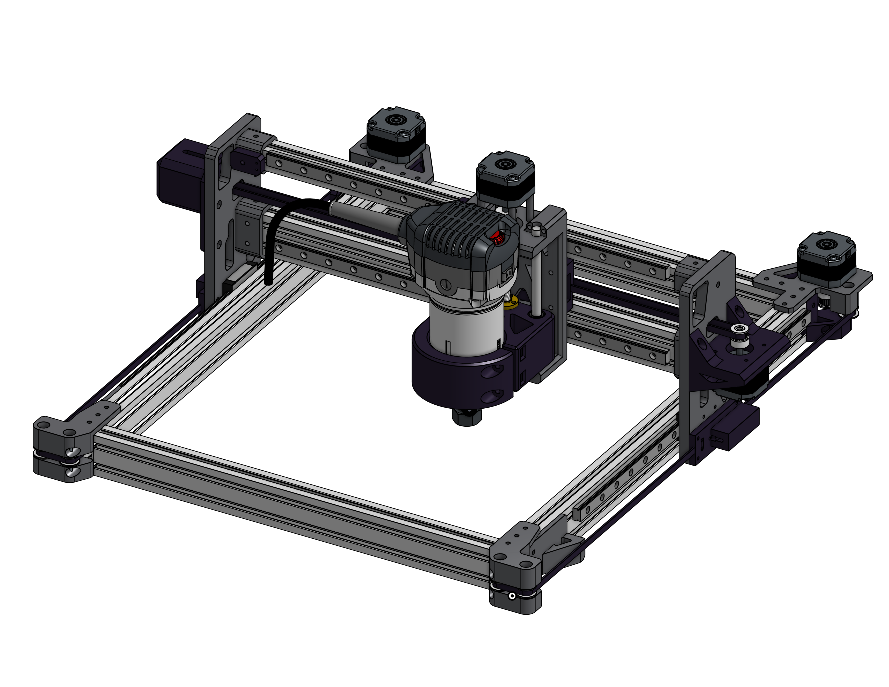
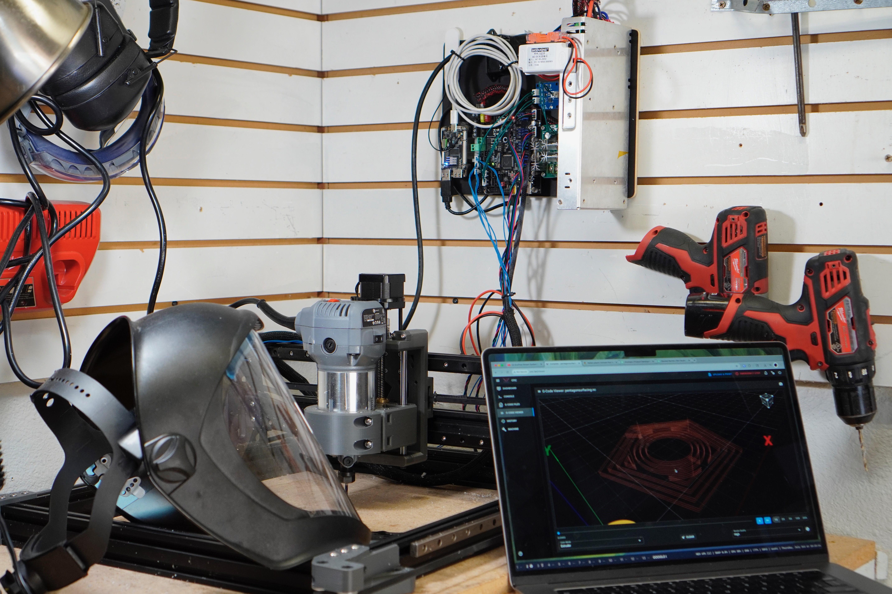

# Videos

## Polycarbonate

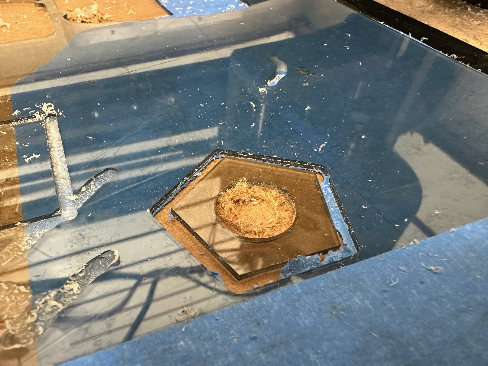
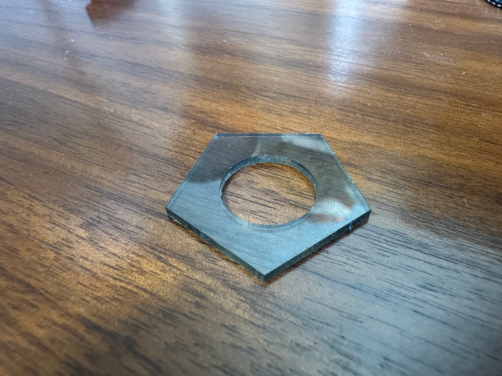

https://github.com/user-attachments/assets/6acb7927-33cb-447a-ad85-6f1f9b60a763

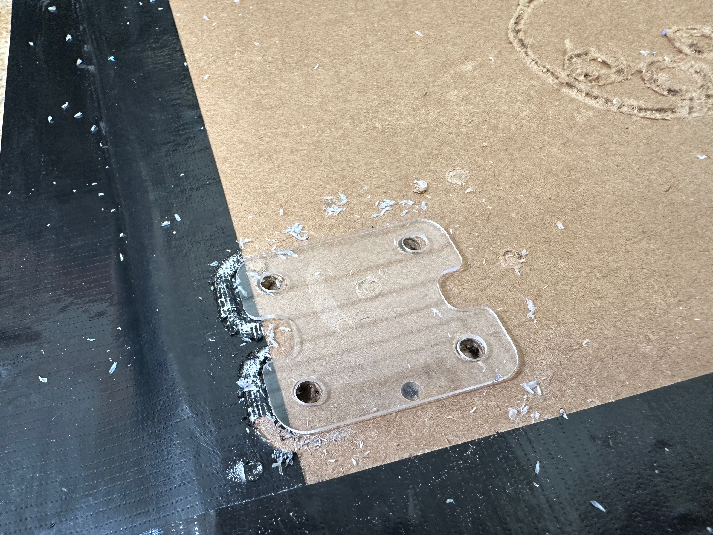

https://github.com/user-attachments/assets/8f0fa02e-e79f-4632-babf-1fa1cd60a0c3

## Plywood

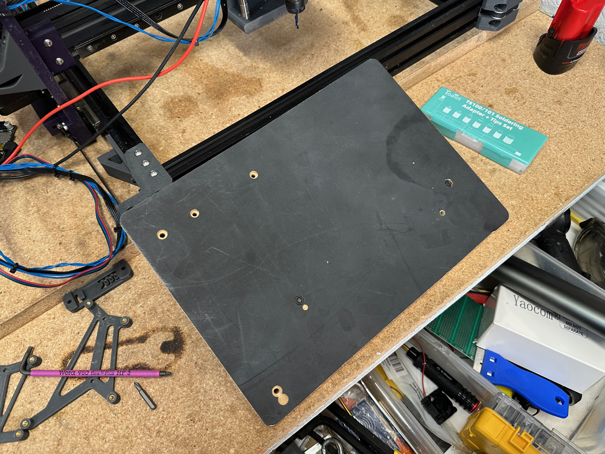

https://github.com/user-attachments/assets/6a91daa9-58b5-4f33-bc3b-5fa999200487

(Fail—Did not properly fasten bit)

https://github.com/user-attachments/assets/d1fd9dd1-560f-435f-840f-3c51d6c63a27

## Cardboard

https://github.com/user-attachments/assets/0a070702-a36b-4b73-86e6-df643ceed8f8

https://github.com/user-attachments/assets/c7c148f7-fc61-4ff0-bef7-0c005a5ad410

# BOM

You should have a stockpile of various screws and misc components, BOM is a constant WIP.

https://docs.google.com/spreadsheets/d/1-7GyJF8yEe2CKIwr3BQy1hE-u1tUgOVvXOGRfo0h9CQ/edit?usp=sharing

# Electronics

# Issues/Questions

For any questions, please open an Github Issue.

# More Images

      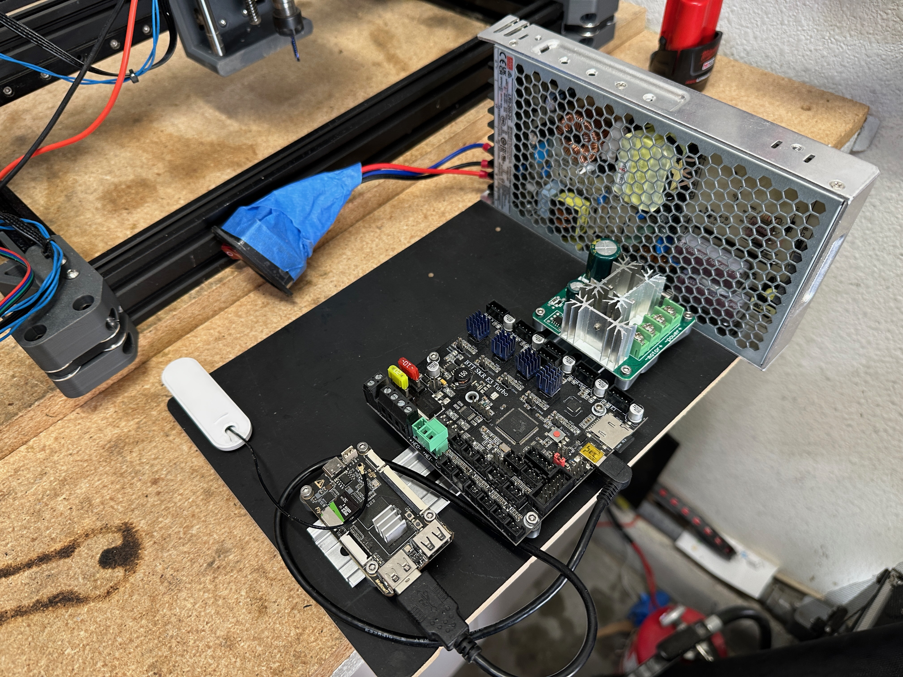 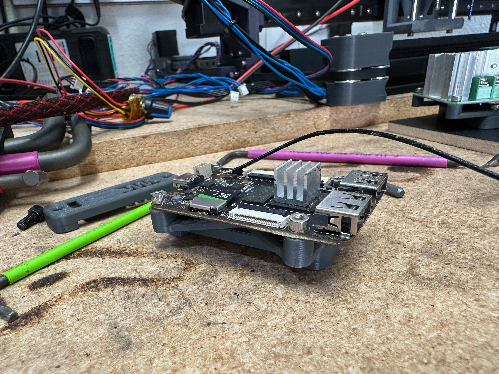 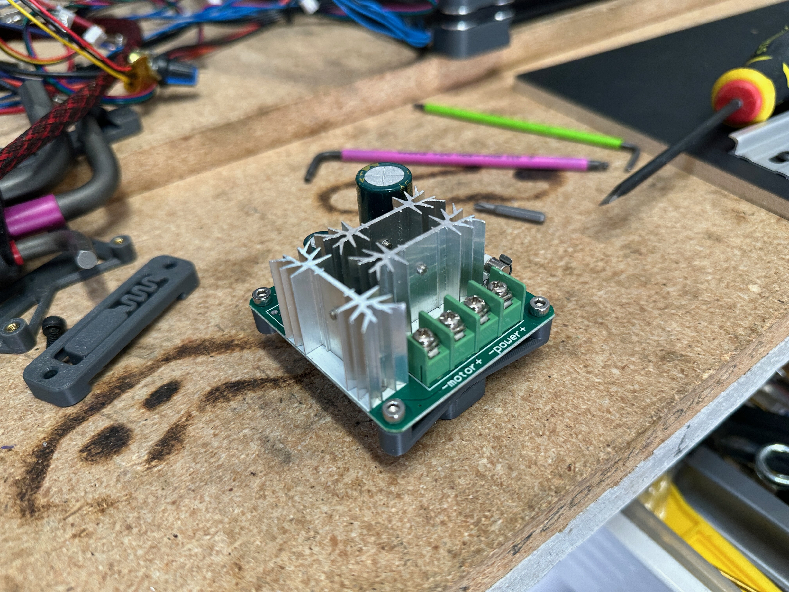 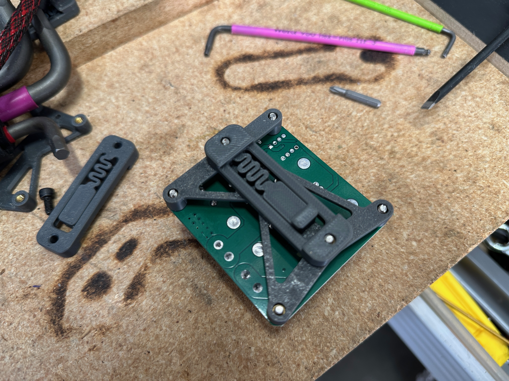 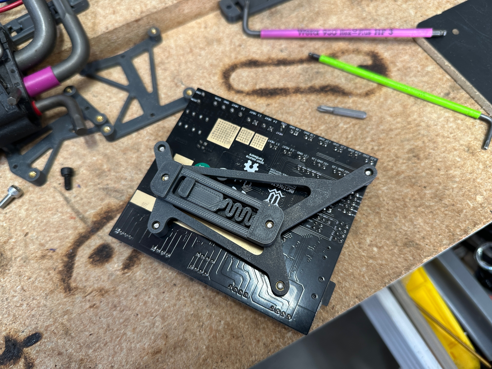 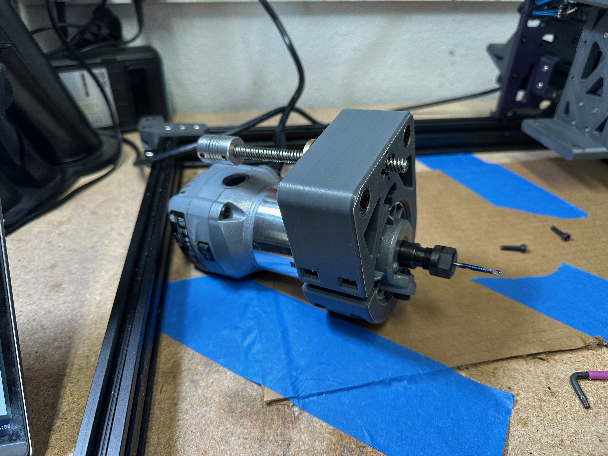 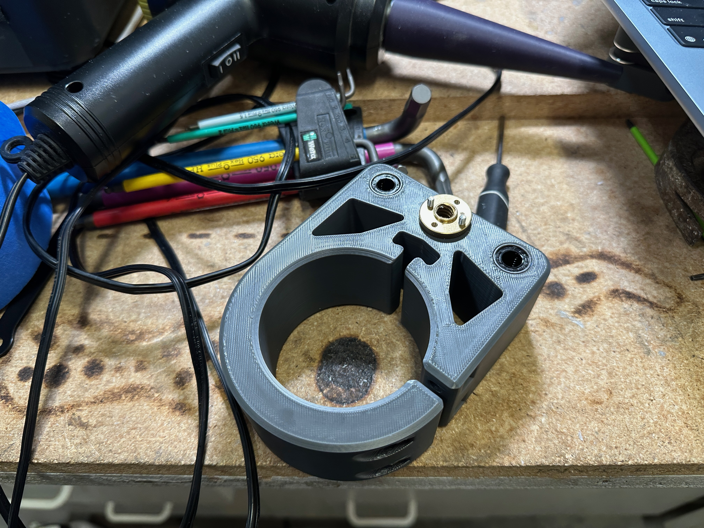
